# Corportate // FISMA

On the Corporate/FISMA side of things, we have an application that acts as a wrapper for Active Directory called [Active Roles from One Identity](https://www.oneidentity.com/landing/active-roles-ppc-campaign-lp/).

You can access our OneIdentity instance [HERE](https://activeroles.na.imtn.com/ADUC/List.aspx?TaskId=DomainsCollection). Please not that there is usually much better performance accessing one of the Servers directly rather than the load balancer URL that is linked above:

- [USNUSMARSP04.na.imtn.com](https://usnusmarsp04.na.imtn.com/ADUC/)
- [USNUSMARSP06.na.imtn.com](https://usnusmarsp06.na.imtn.com/ADUC/)

## Group Assignment

### Important Groups

| Site | AD Group | Project |
| ---- | -------- | ------- |
| BOPA | DMS_OPS_BOPA_DLA_Users | DLA |
| JEMD | DMS_OPS_DEA_Users | DEA |
| JEMD | DMS_OPS_DLA_Users | DLA |
| ROPA | DMS_OPS_ROFO_IRS | IRS |
| ROPA | DMS_OPS_DLA_Users | DLA |
| SLMO | DMS_OPS_SLMO_GDIT | GDIT |
| TAFL | DMS_OPS_TAFL_DLA_Users | DLA |

### Addition

Requests to add Users to a Group will come in the form of a SNOW request, specifically an SCTASK, and will generally look like this:

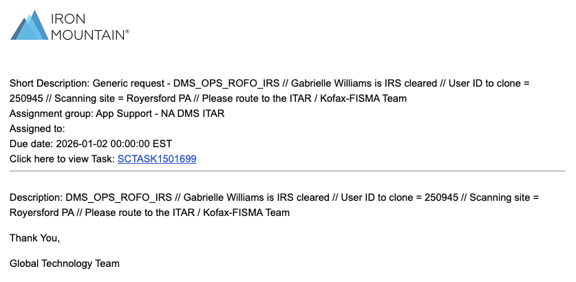

Here are the steps to complete a request to add one or more Users to a Group within Active Roles:

1. Click the link in the request notification e-mail to open the ticket.
    1. `Click here to view Task: SCTASK1234567`
2. Make sure it is assigned to our `ITAR` Group:
    1. `App Support - NA DMS ITAR`
3. Assign it to yourself by searching for and selecting your name.
4. Change the `State` to `Work in Progress`.
5. Add a note stating that you're working on the request.
6. Click `Update` at the top.
7. Login to Active Roles.
8. In the upper, right-hand corner search for the Group you wish to add the User(s) to.
    1. For this example, we are going to use the `DMS_OPS_ROFO_IRS` Group.
9. After searching, it should look like this:

10. Next, you want to select the Group by checking the box to the left of the Group name or by clicking anywhere the cursor shows as a plus (+) sign.
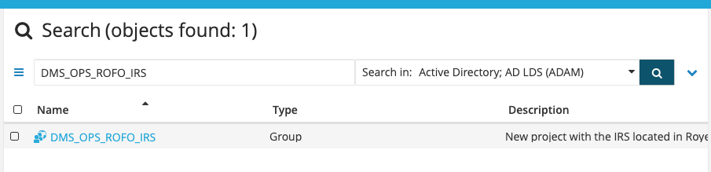
11. On the right side of the screen, click on the link for Members.
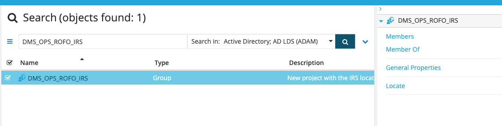
12. Click on the `Add` button.
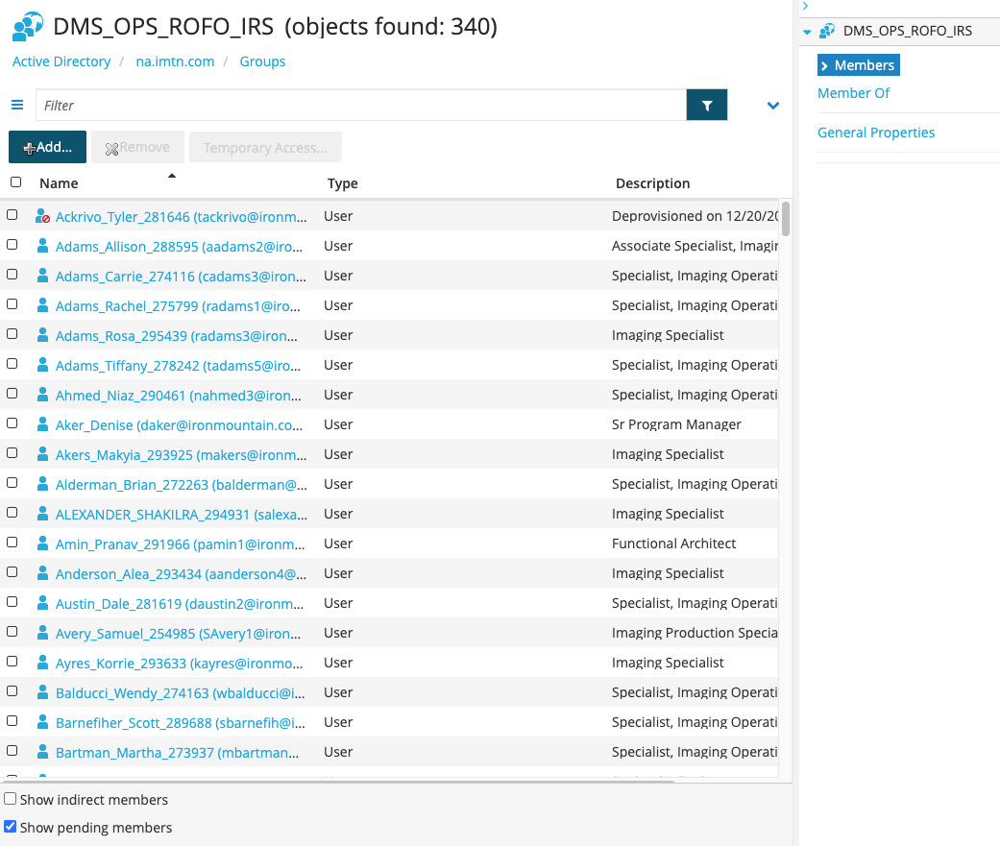
13. Type in the name of the User you wish to add and press `Enter`.
    1. Make sure you are looking for the Username that includes their Employee ID number. This ensures you have the correct account.
        1. `Smith_John_123456`
14. Select the User by checking the box on the left or clicking anywhere the cursor shows as a plus (+) sign.
    1. You will see their name appear in the bottom of the pop-up window.
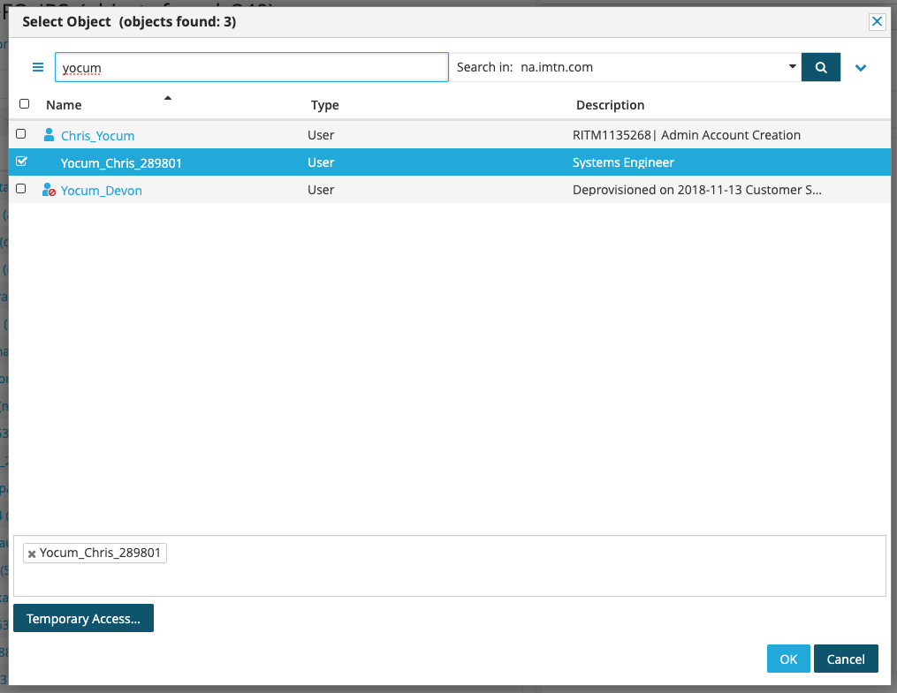
15. If you are only adding one User, skip to Step 11.
16. If you are adding multiple Users to this single request, repeat Steps 7-8 until you've selected all of the Users you wish to add.
    1. When selecting multiple Users, it is IMPERITIVE that you select the Users by checking the box to the left of their name. If you select them by clicking anywhere the cursor shows as a plus (+) sign it will overwrite any/all previously selected Users with that one User.
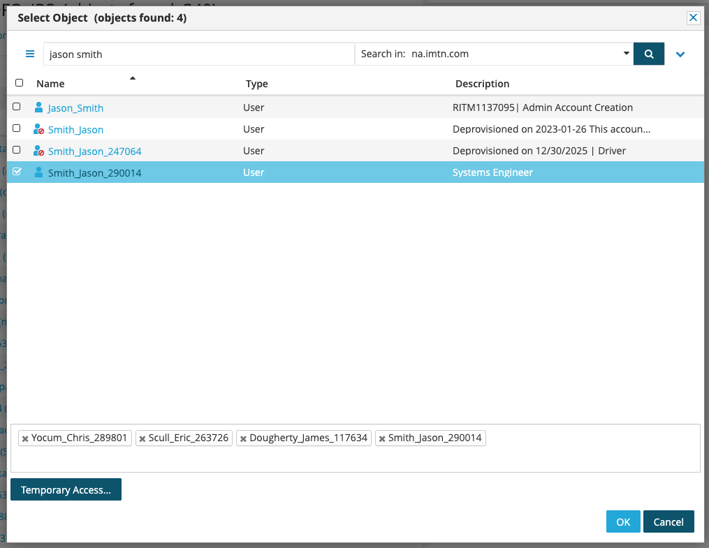
17. Click the `Ok` button.
18. A box will pop up stating that approval is required. All adds to certain Groups, like `DMS_OPS_ROFO_IRS`, require approval.
    1. Enter either the `RITM` or `SCTASK` number for the request.
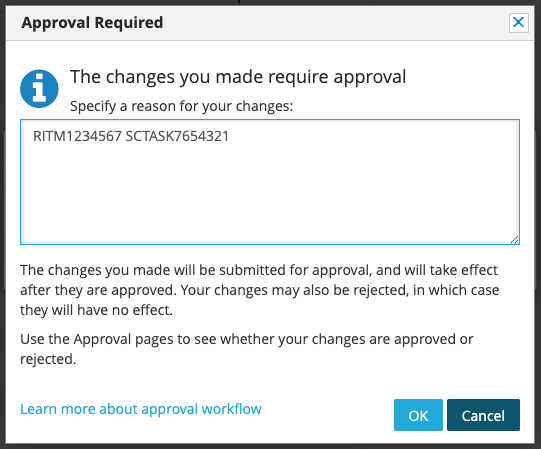
19. Click the `Ok` button.
20. Go back to the request ticket and add another comment that the request has been submitted and is waiting for Manager approval and then click `Update`.
21. Go to Google Chat, go to the `US GOV` Space and ping your respective Manager (most likely Min Ham) for approval.
    1. `@Min Ham I have some IRS adds for you to approve when you get a chance.`
22. Once your Manager responds that your request(s) have been approved you can go back to the request ticket and update the `State` to `Closed Completed`.
23. Set the `Closure Category` to `Access Management`.
24. Set the `Closure Code` to `UserAccess update`.
25. Add a note that the request has been completed.
26. Scroll back to the top and click `Update`.

### Removal

Requests to remove Users from a Group will come in the form of a SNOW request, specifically an SCTASK, and will generally look like this:

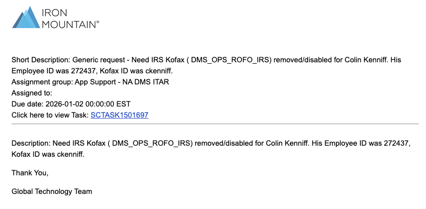

Here are the steps to remove one or more Users from a Group within Active Roles:

1. Click the link in the request notification e-mail to open the ticket.
    1. `Click here to view Task: SCTASK1234567`
2. Make sure it is assigned to our `ITAR` Group:
    1. `App Support - NA DMS ITAR`
3. Assign it to yourself by searching for and selecting your name.
4. Change the `State` to `Work in Progress`.
5. Add a note stating that you're working on the request.
6. Click `Update` at the top.
7. Login to Active Roles.
8. In the upper, right-hand corner search for the Group you wish to add the User(s) to.
    1. For this example, we are going to use the `DMS_OPS_ROFO_IRS` Group.
9. After searching, it should look like this:

10. Next, you want to select the Group by checking the box to the left of the Group name or by clicking anywhere the cursor shows as a plus (+) sign.

11. On the right side of the screen, click on the link for Members.

12. In the filter box at the top type in the User's name and press `Enter`.
13. Select the User by checking the box on the left or clicking anywhere the cursor shows as a plus (+) sign.
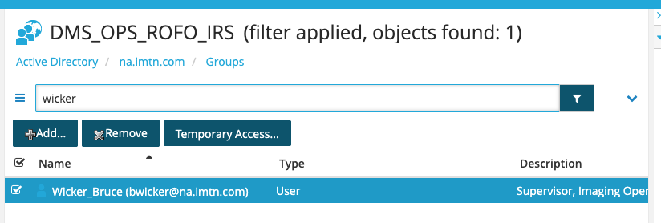
14. Click the `Remove` button.
15. You will see a pop-up box asking you to confirm the removal of the User from the Group. Click `Yes`.
16. A box will pop up stating that approval is required. All removals from certain Groups, like `DMS_OPS_ROFO_IRS`, require approval.
    1. Enter either the `RITM` or `SCTASK` number for the request.

17. Click the `Ok` button.
18. Go back to the request ticket and add another comment that the request has been submitted and is waiting for Manager approval and then click `Update`.
19. Go to Google Chat, go to the `US GOV` Space and ping your respective Manager (most likely Min Ham) for approval.
    1. `@Min Ham I have some IRS removals for you to approve when you get a chance.`
20. Once your Manager responds that your request(s) have been approved you can go back to the request ticket and update the `State` to `Closed Completed`.
21. Set the `Closure Category` to `Access Management`.
22. Set the `Closure Code` to `UserAccess update`.
23. Add a note that the request has been completed.
24. Scroll back to the top and click `Update`.

## Unlock Account

More often than not, requests to unlock an account will come through as just an e-mail. It is best practice to have the requestor submit a ticket for tracking purposes, but you can help them out beforehand just to get them up and running again.

I'm not going to outline the steps for handling a SNOW ticket again as it is shown twice above, but here is how to unlock a locked account for Corp/FISMA AD:

1. Login to Active Roles.
2. In the upper, right-hand corner search for the User you wish to reset the password for.
3. After searching, it should look like this:
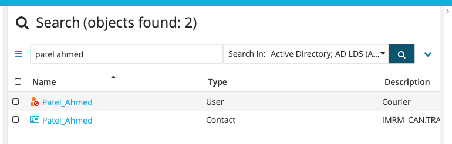
4. Next, you want to select the User by checking the box to the left of the User's name or by clicking anywhere the cursor shows as a plus (+) sign.
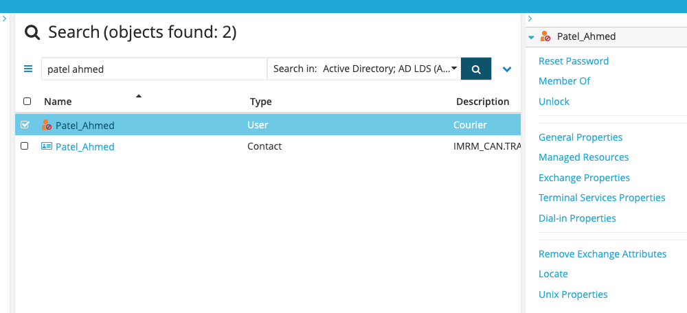
5. On the right side of the screen, click the link that says `Unlock`.
6. You will get a confirmation that it completed successfully:
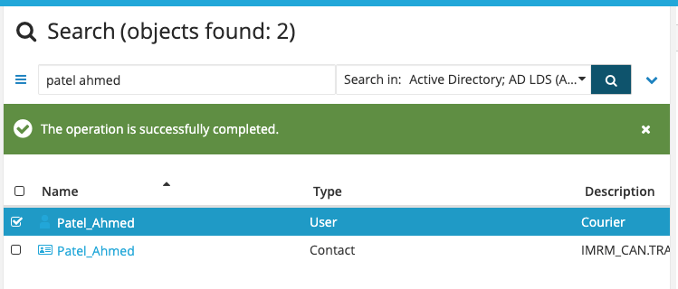
7. Reply to the e-mail to let them know that the account has been unlocked and ask them to please submit a SNOW ticket for tracking.
8. Once the SNOW ticket comes in, assign it to yourself and close it out.

## Password Reset

More often than not, requests to reset the password for an account will come through as just an e-mail. It is best practice to have the requestor submit a ticket for tracking purposes, but you can help them out beforehand just to get them up and running again.

I'm not going to outline the steps for handling a SNOW ticket again as it is shown above, but here is how to reset the password for an account for Corp/FISMA AD:

1. Login to Active Roles.
2. In the upper, right-hand corner search for the User you wish to reset the password for.
3. After searching, it should look like this:
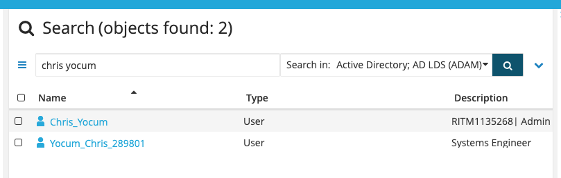
4. Next, you want to select the User by checking the box to the left of the User's name or by clicking anywhere the cursor shows as a plus (+) sign.
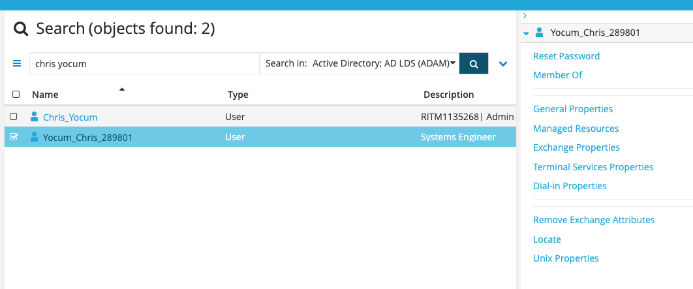
5. On the right side of the screen, click the link at the top that says `Reset Password`.
6. Click the `Generate` button to generate a random password:
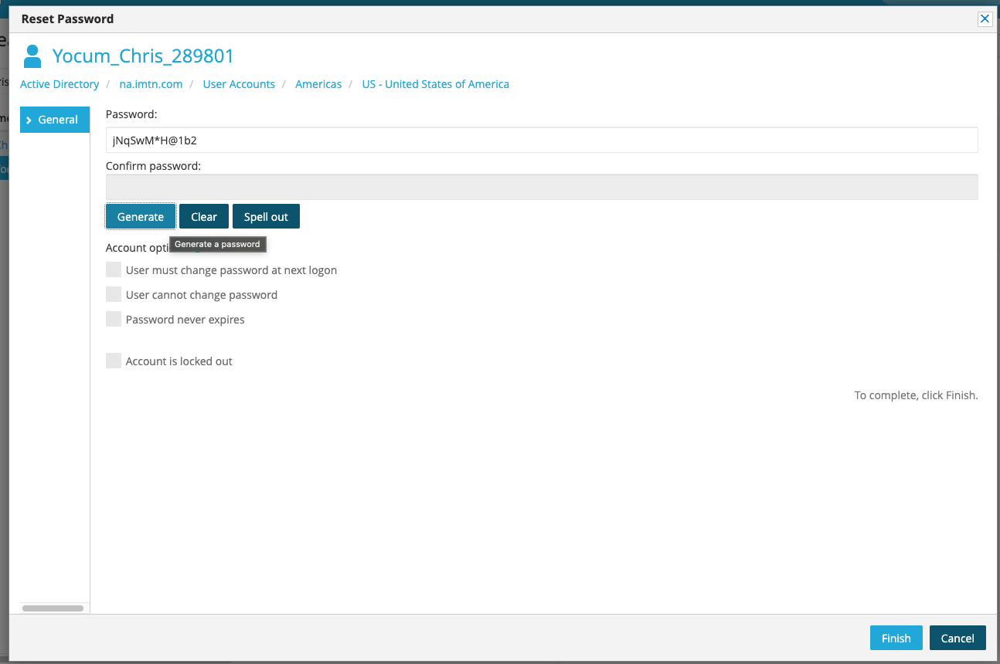
7. Take a screenshot of the password and save it as you will reply to the e-mail request with it.
8. Click the `Spell out` button and take a screenshot of the provided spelling out of the password as you're going to also include it in the e-mail response.
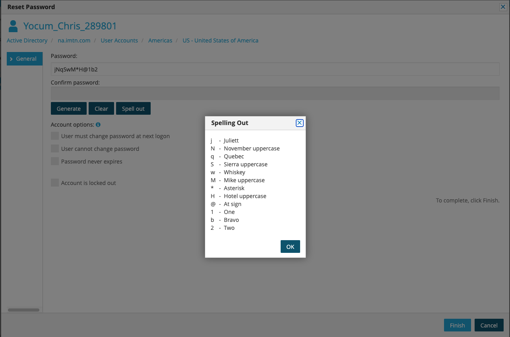
9. Click the `Finish` botton to complete the password reset.
10. Reply to the e-mail, do NOT Reply All as you do not want to share the password with everyone on the e-mail, and include the two screenshots you took.
    1. Ask them to please submit a SNOW ticket for tracking.
11. Once the SNOW ticket comes in, assign it to yourself and close it out.