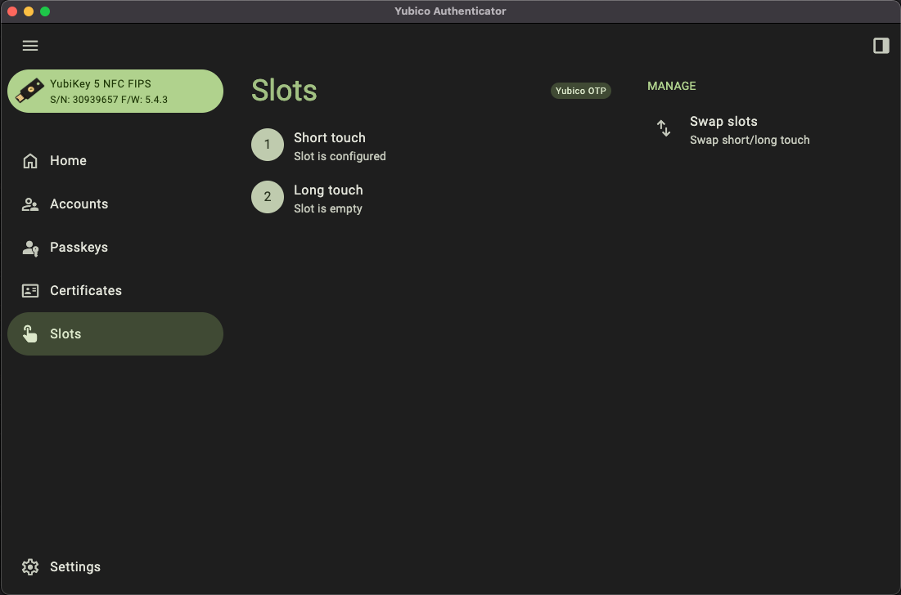
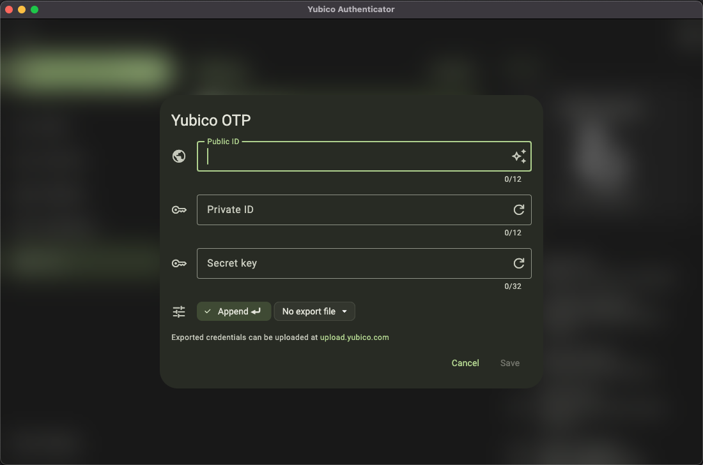
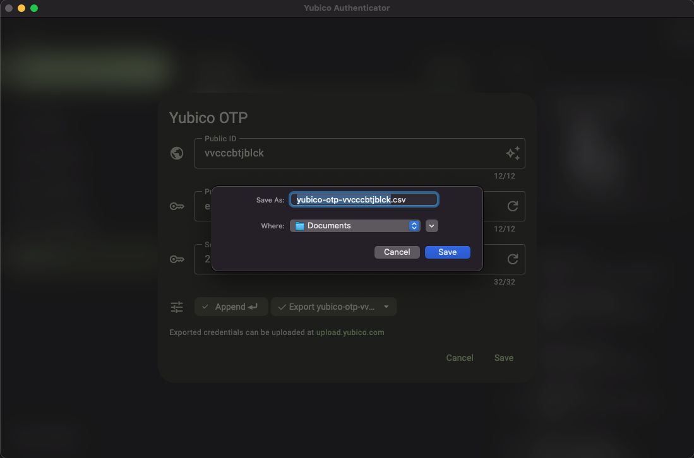
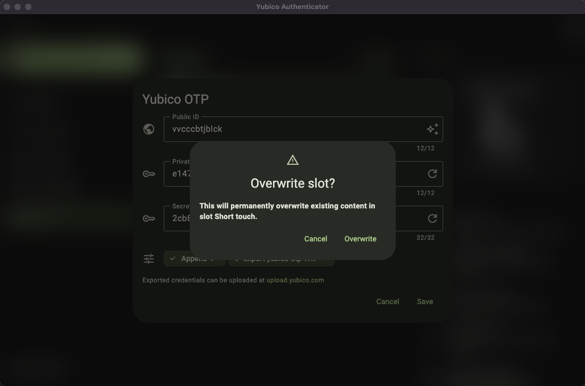

# Yubico Authenticator Application

The [Yubico Authenticator](https://www.yubico.com/products/yubico-authenticator/) is a GUI utility for managing your YubiKey.

This can be used to manage one YubiKey at a time, and is meant more for end users than Administrators.

To create or overwrite a YubiKey slot's configuration:

1. Insert the YubiKey into a USB port.
2. Start the YubiKey Authenticator.
3. You should see the app populate the data from your YubiKey.

4. Click "Slot 1" at the top.
5. Click "Yubico OTP" on the right-hand side under "Setup".

6. Click on the diamond, sparkly icon at the end of the `Public ID` box to use the Serial Number as the Public ID.
7. Click the "Generate random" button at the end of the `Private ID` box to generate a Private ID for the YubiKey.
8. Click the "Generate random" button at the end of the `Secret key` box to generate a Private ID for the YubiKey.
9. Click the drop-down menu that says "No export file" and click "Select file".

10. The default location and name should be fine. Just don't forget it.
11. Click the "Save" button.
12. Click the "Save" button in the bottom, right-hand corner.
13. A box will pop up asking you to confirm that you wish to overwrite the existing configuration for the slot. Click "Overwrite".

14. You should see a message at the bottom of the screen confirming that the configuration has been saved and that the information has been exported to the CSV file that you specified in Step 10.